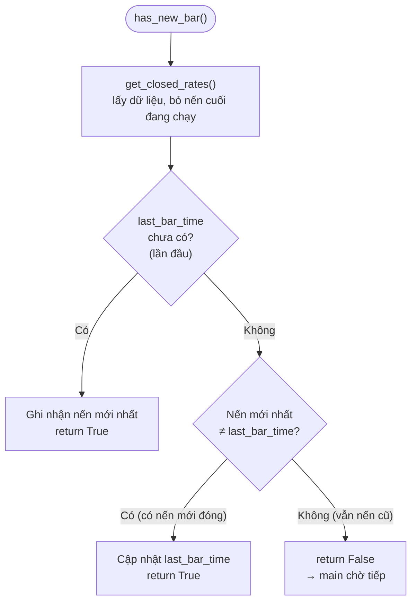
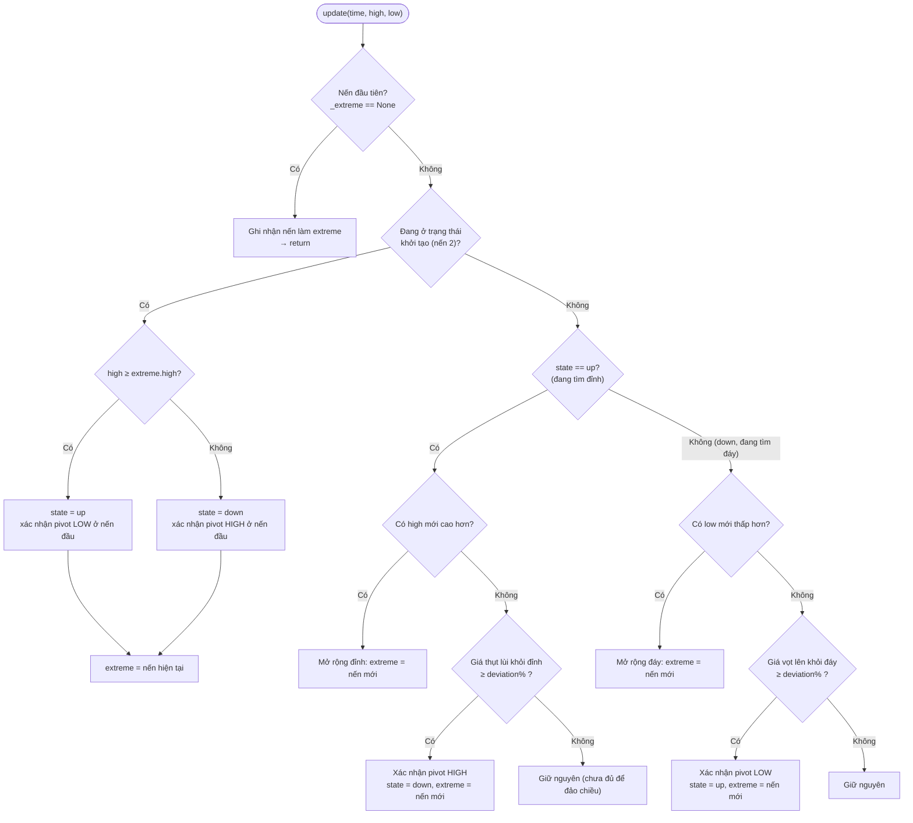
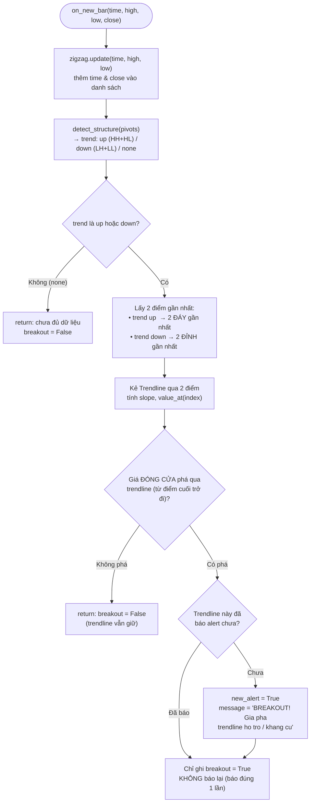
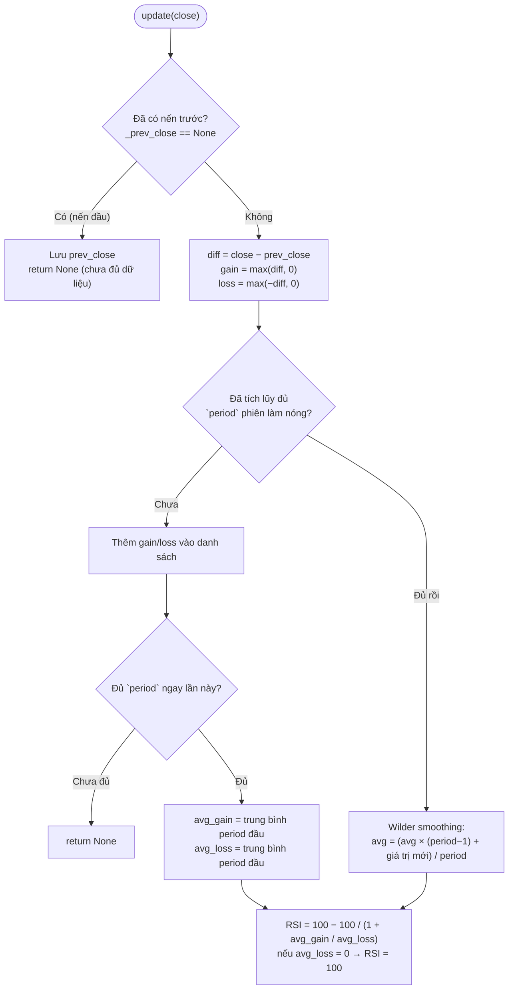
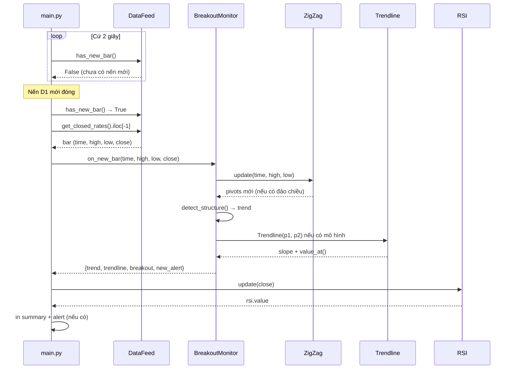

# Sơ đồ hoạt động — Bot giao dịch MT5 (XAUUSD)

Tài liệu mô tả chương trình **đang chạy như thế nào**, từ lúc khởi động đến vòng lặp theo dõi nến mới.
Các sơ đồ viết bằng [Mermaid](https://mermaid.js.org/) — mở file này trong VSCode/GitHub/GitLab để xem dạng đồ họa.

---

## 1. Kiến trúc tổng quan

```
┌────────────────────────────────────────────────────────────────────┐
│                             main.py                                │
│  Vòng lặp chính: chờ nến mới đóng → kiểm tra → in kết quả         │
│  → ghi biểu đồ (chart_render.py)                                   │
└───┬───────────────┬─────────────────┬───────────────┬─────────┬────┘
    │               │                 │               │         │
    ▼               ▼                 ▼               ▼         ▼
┌──────────┐  ┌───────────┐   ┌──────────────┐  ┌─────────┐  ┌─────────────┐
│ data_feed│  │  zigzag   │   │  trendline   │  │   rsi   │  │chart_render │
│  (MT5)   │  │ ZigZag    │   │ Trendline +  │  │ RSI     │  │ Xuất chart  │
│          │  │ (điểm đảo │   │ BreakoutMonitor│ │ (Wilder)│  │ .html + .json│
│ Lấy nến  │  │ chiều)    │   │              │  │         │  │             │
└────┬─────┘  └───────────┘   └──────────────┘  └─────────┘  └─────────────┘
     │
     ▼
┌────────────┐
│ Terminal   │
│ MetaTrader5│
└────────────┘
```

- **data_feed.py** — kết nối MT5, lấy nến OHLCV, chỉ trả về **nến đã đóng** (tránh repaint/lookahead bias).
- **zigzag.py** — nhận diện swing high / swing low theo ngưỡng `deviation%`.
- **trendline.py** — kẻ đường xu hướng qua 2 điểm ZigZag, phát hiện giá **phá vỡ** (breakout).
- **rsi.py** — RSI công thức Wilder, cập nhật từng nến.
- **chart_render.py** — gom trạng thái hiện tại (nến + ZigZag + trendline + breakout + RSI) thành JSON, ghi ra `chart.html` (biểu đồ nến tự chứa — mở trình duyệt là thấy trendline được vẽ) và `chart_state.json`.

---

## 2. Sơ đồ hoạt động chính (main.py)

```mermaid
flowchart TD
    Start(["BẮT ĐẦU<br/>python main.py"]) --> Connect["Kết nối MT5<br/>mt5.initialize() + symbol_select('XAUUSD')"]
    Connect --> OK{"Kết nối +<br/>chọn symbol<br/>thành công?"}
    OK -- "Lỗi" --> Err(["KẾT THÚC<br/>RuntimeError: kiểm tra terminal MT5"])
    OK -- "OK" --> Init["Khởi tạo:<br/>DataFeed(D1, 300 nến)<br/>BreakoutMonitor(deviation=6.0%)<br/>RSI(period=14)"]
    Init --> Warmup["Khởi động (warm-up):<br/>lặp từng nến lịch sử đã đóng:<br/>• mon.on_new_bar(...) → ZigZag + trendline<br/>• rsi.update(close)<br/><i>(làm cho chỉ báo 'sẵn sàng' từ nến hiện tại)</i>"]
    Warmup --> Mark["Đánh dấu nến đã xử lý:<br/>feed.has_new_bar()<br/><i>(lần gọi đầu luôn trả True và bị 'nuốt'</i><br/><i>→ vòng lặp không chạy lại nến vừa nạp)</i>"]
    Mark --> PrintInit["In trạng thái hiện tại:<br/>mô hình + trendline + RSI + breakout"]
    PrintInit --> Loop["VÒNG LẶP CHÍNH"]

    Loop --> Sleep["Chờ CHECK_INTERVAL = 2 giây"]
    Sleep --> HasNew{"feed.has_new_bar()?<br/>có nến mới đóng<br/>so với lần kiểm tra trước?"}
    HasNew -- "Không" --> Sleep
    HasNew -- "Có" --> GetBar["Lấy nến đóng mới nhất:<br/>get_closed_rates().iloc[-1]"]
    GetBar --> Analyze["Phân tích:<br/>• mon.on_new_bar(time, high, low, close)<br/>• rsi.update(close)"]
    Analyze --> Print["In summary:<br/>mô hình (TANG/GIAM)<br/>trendline (giá trị + slope)<br/>RSI (quá mua/quá bán)<br/>trạng thái breakout"]
    Print --> Alert{"Có alert mới?<br/>(new_alert = True)"}
    Alert -- "Có" --> ShowAlert["In *** BREAKOUT! ***"]
    Alert -- "Không" --> Continue
    ShowAlert --> Continue
    Continue --> Stop{"Người dùng nhấn<br/>Ctrl+C?"}
    Stop -- "Chưa" --> Sleep
    Stop -- "Có" --> Shutdown["Đóng kết nối MT5<br/>feed.shutdown()"]
    Shutdown --> End(["KẾT THÚC"])
```



> Điểm mấu chốt: chương trình chỉ chạy **đúng 1 lần kiểm tra** khi có nến mới đóng trên D1 — không tính lại theo từng tick giá.

---

## 3. Chi tiết từng bước

### 3.1 DataFeed.has_new_bar() — phát hiện nến mới



### 3.2 ZigZag.update() — xác định điểm đảo chiều



### 3.3 BreakoutMonitor.on_new_bar() — trendline + breakout



### 3.5 chart_render.py — vẽ trendline ra biểu đồ

Mỗi lần main.py phân tích xong (khởi động + mỗi nến D1 mới đóng) nó ghi đè
`chart.html` — trang HTML **tự chứa** (SVG thuần, không cần CDN/server), nhúng sẵn
dữ liệu MT5 thật: nến đã đóng, các điểm pivot ZigZag (▲ đỉnh / ▼ đáy), trendline
(đường đứt nét: nâu = hỗ trợ khi mô hình TĂNG, tím = kháng cự khi mô hình GIẢM),
điểm breakout (⭐) và RSI. Mở file bằng trình duyệt (hoặc tab Preview) là thấy
trendline được vẽ; chạy lại `main.py` mỗi khi có nến mới đóng rồi làm mới trang
trình duyệt để cập nhật. Nếu chạy qua `python -m http.server`, trang tự đọc
`chart_state.json` mỗi 2 giây để cập nhật live.

```mermaid
flowchart LR
    A["main.py phân tích xong"] --> B["build_state()<br/>gom nến + pivot + trendline"]
    B --> C["write_chart_page()<br/>ghi chart.html (nhúng dữ liệu)"]
    B --> D["write_chart_state()<br/>ghi chart_state.json"]
    C --> E["Mở chart.html → thấy trendline"]
    D -. chạy qua http.server .-> F["chart.html tự cập nhật 2s"]
```

### 3.4 RSI.update() — RSI Wilder



---

## 4. Chuỗi gọi hàm theo thời gian (một lần kiểm tra)



---

## 5. Tóm tắt trạng thái hiện tại

| Hạng mục | Giá trị đang dùng (main.py) |
|---|---|
| Symbol | `XAUUSD` (vàng) |
| Khung thời gian | `D1` |
| Số nến lấy mỗi lần | `300` |
| Ngưỡng đảo chiều ZigZag | `6.0%` |
| RSI | `period = 14` |
| Chu kỳ kiểm tra | `2 giây` |
| Điều kiện báo | Giá đóng cửa phá trendline (hỗ trợ nếu mô hình tăng, kháng cự nếu giảm), mỗi trendline báo 1 lần |
| Chỉ tính trên | Nến đã đóng (`get_closed_rates`) |
| Hiển thị trendline | `chart.html` — biểu đồ nến tự chứa, ghi lại sau mỗi lần phân tích (mở trình duyệt là xem được) |
